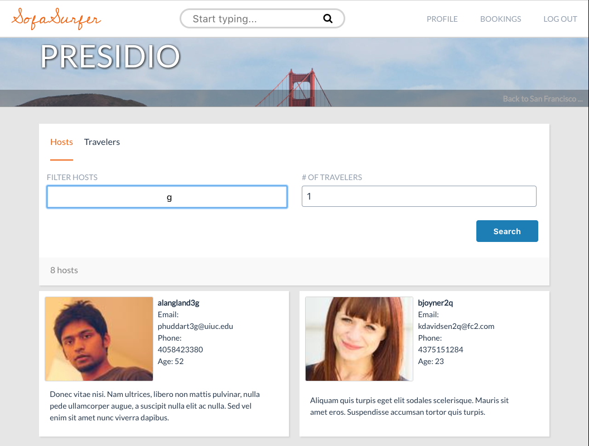
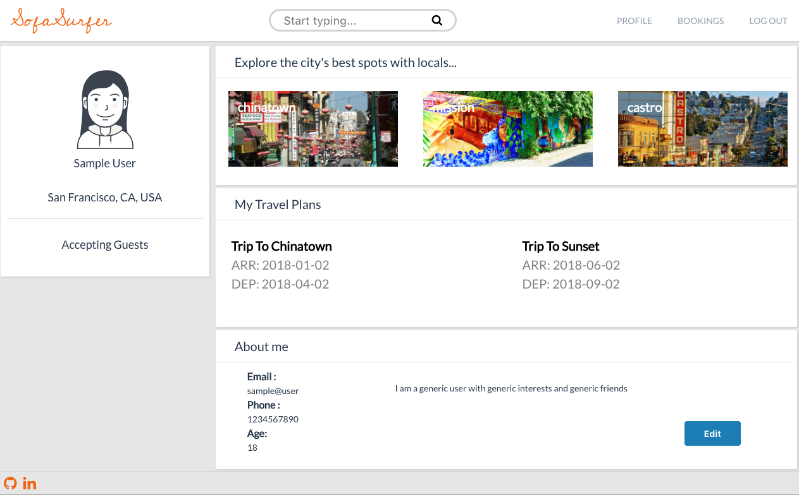

# sofa_surfer

[SofaSurfer Live](https://sofasurfer.herokuapp.com/)

Sofa Surfer is a free lodging website for those who want to explore the various corners of San Francisco, with locals who know the area, inspired by CouchSurfing.  It utilizes Rails/PostgresSQL backend with React.js and Redux on the frontend.

This bulk project was designed and constructed in less than two weeks; however, I plan to continue making improvements in the future.

## Features

* Secure user authentication in both the frontend and the backend using BCrypt.
* Users can view locations around San Francisco, CA, USA, and identify hosts to facilitate the adventure.
* Application dynamically adapts to display all information in a beautiful way.
* Search the application for users and locations.
* Filter hosts by username, email, and other user information to meet the needs of your trip.
* Users can create, read, update, and destroy bookings with other users.
* Users can update their user information.

### Search

The search bar in the header enables the user to traverse the application with ease as the tool uses input characters to find any relevant user or location information.  The results of a search are sorted alphabetically, and separated by neighborhood and username.  The placement of the feature makes it available throughout the user experience; thus, making it a valuable asset to any SofaSurfer.  

This feature builds on its functionality in the show page for a particular neighborhood.  As there may be hundreds of hosts in a particular area, it it can be difficult to find someone who meets your distinct needs.  The filter search option enables the user to filter the hosts by username, email, and other personal information.

This was accomplished by building a search function in the backend of the user and location models.  This function was built using the PostgresSQL.

    class User < ApplicationRecord
        def self.search(term)
            User
                .where("username ILIKE :term OR email ILIKE :term OR street ILIKE :term OR phone ILIKE :term", term: "%#                        {term}%")
            end
        end
    end

    class Location < ApplicationRecord
        def self.search(term)
            Location
                .where("neighborhood ILIKE :term", term: "%#{term}%")
        end
    end

This was troubling due to the fact that I had to parse both the locations and the users for a variety of different model attributes.  My solution to create two separate requests led to easily-read code and usability throughout the application.

### Dashboard

The dashboard feature is dynamic in that it offers the user a glimpse at the variety of functionality available to them thorughout the application.  It enables the user to update their information, view their current trips, and glance at an ever-changing preview of neighborhoods around San Francisco.

This presented a variety of issues including making various requests to the backend.  This necessitated code optimization and minimalist styling so as to not overwhelm the user.  The create, read, update functionality of the user sits in a React modal component, adding to the functionality and minimalism of the page.  

Another challenge presented was the generating of the random neighborhoods. This was accomplished with a simple randomness function based on the number of locations.

    let spotsPreview;

    if (this.props.spots.length > 0) {
      let previews = parseInt(Math.random() * locations.length);
      let spot1 = spots[previews];
      let spot2 = spots[previews+1];
      let spot3 = spots[previews+2];

      spotsPreview = spots.length > 3 ?
        

          <SpotPreviewItem key={spot1.id} spot={spot1}/>
          <SpotPreviewItem key={spot2.id} spot={spot2} />
          <SpotPreviewItem key={spot3.id} spot={spot3} />
        
 : '';
    }

## Project Design

SofaSurfer is designed with minimalism and functionality as its primary intentions. The various routes available to the user leave them feeling compelled to not only explore the site, but also the city of San Francisco.  Keeping code functional is prioritized as the timeframe for production was limited.  Smooth, bug-free navigation is imperative to this site's success.  

There are several pages (i.e. the locations index page) that rely on the beauty of the city for the elegance of the site, while the functional booking page encourages the user to fill the page with their own exciting adventures.

## Technologies

Rails is used for this site due to its support for relational databases and RESTful architecture.  The offered the functionality needed for an application built with such haste.  This project is meant as a portfolio piece; thus, the technologies were chosen to be adequate for the work load.

Frontend Redux states are set up in a way such that there are separate reducers and actions for locations, bookings, dashboard, search, users, headers, and footers, and errors. This normalizes the state, easing the task of keeping things up-to-date with changes in the database.

## Possible Future Features

* User to user reviews
* Additional styling
* Updated search/filter functionality
